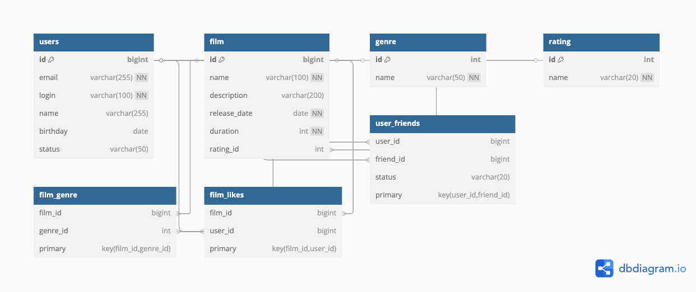

# Filmorate: ER-диаграмма базы данных



---

## Описание схемы

Проект Filmorate хранит информацию о фильмах, жанрах, рейтингах (MPA), пользователях, их лайках и **односторонней дружбе**. 

### Таблицы:

- **film** — фильмы с основной информацией.
- **genre** — список жанров.
- **film_genre** — связь многие-ко-многим между фильмами и жанрами.
- **rating** — рейтинги MPA (G, PG, PG-13, R, NC-17).
- **users** — пользователи системы.
- **film_likes** — пользователи ставят лайки фильмам (many-to-many).
- **user_friends** — система **односторонней дружбы** (user подписан на friend).

---

## Примеры SQL-запросов

### 🔝 Топ-10 популярных фильмов по количеству лайков:
```sql
SELECT f.*
FROM film f
LEFT JOIN film_likes fl ON f.id = fl.film_id
GROUP BY f.id
ORDER BY COUNT(fl.user_id) DESC
LIMIT 10;
```

### 👥 Общие друзья двух пользователей:
```sql
SELECT uf1.friend_id
FROM user_friends uf1
         JOIN user_friends uf2 ON uf1.friend_id = uf2.friend_id
WHERE uf1.user_id = 1 AND uf2.user_id = 2;
```

### 🎥 Фильмы определённого жанра:
```sql
SELECT f.*
FROM film f
         JOIN film_genre fg ON f.id = fg.film_id
         JOIN genre g ON fg.genre_id = g.id
WHERE g.name = 'Комедия';
```

### 📊 Количество лайков у каждого фильма:
```sql
SELECT f.name, COUNT(fl.user_id) AS like_count
FROM film f
         LEFT JOIN film_likes fl ON f.id = fl.film_id
GROUP BY f.id, f.name;
```

---