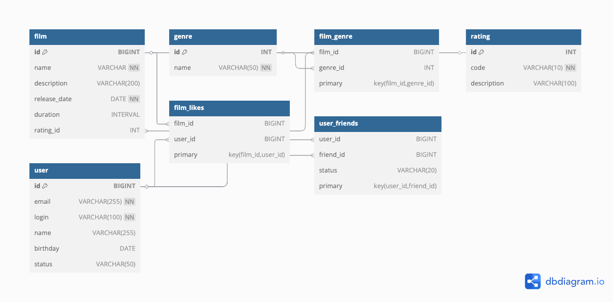

# Filmorate: ER-диаграмма базы данных

## ER-диаграмма



---

## Описание схемы

Проект Filmorate хранит информацию о фильмах, жанрах, рейтингах, пользователях, их дружбе и лайках. Схема базы данных нормализована и поддерживает основные бизнес-процессы приложения.

### Таблицы:

- **film** — фильмы с основной информацией.
- **genre** — список жанров.
- **film_genre** — связь многие-ко-многим между фильмами и жанрами.
- **rating** — рейтинги MPA (G, PG, PG-13, R, NC-17).
- **user** — пользователи системы.
- **film_likes** — пользователи ставят лайки фильмам (many-to-many).
- **user_friends** — система дружбы между пользователями с флагом подтверждения.

---

## Примеры SQL-запросов

### 🔝 Топ-10 популярных фильмов по количеству лайков:
```sql
SELECT f.*
FROM film f
JOIN film_likes fl ON f.id = fl.film_id
GROUP BY f.id
ORDER BY COUNT(fl.user_id) DESC
LIMIT 10;
```

### 👥 Общие друзья двух пользователей:
```sql
SELECT f.friend_id
FROM user_friends f
JOIN user_friends f2 ON f.friend_id = f2.friend_id
WHERE f.user_id = 1 AND f2.user_id = 2
  AND f.status = 'confirmed' AND f2.status = 'confirmed';
```

### 🎥 Фильмы определённого жанра:
```sql
SELECT f.*
FROM film f
JOIN film_genre fg ON f.id = fg.film_id
JOIN genre g ON fg.genre_id = g.id
WHERE g.name = 'Комедия';
```

### 📊 Количество лайков у каждого фильма:
```sql
SELECT f.name, COUNT(fl.user_id) AS like_count
FROM film f
LEFT JOIN film_likes fl ON f.id = fl.film_id
GROUP BY f.id, f.name;
```

---

## 📌 Заметки

- ER-диаграмма экспортирована из dbdiagram.io.
- Все таблицы приведены к 3НФ.
- Поддерживается расширение функциональности (например, списки рекомендаций или отзывы).
